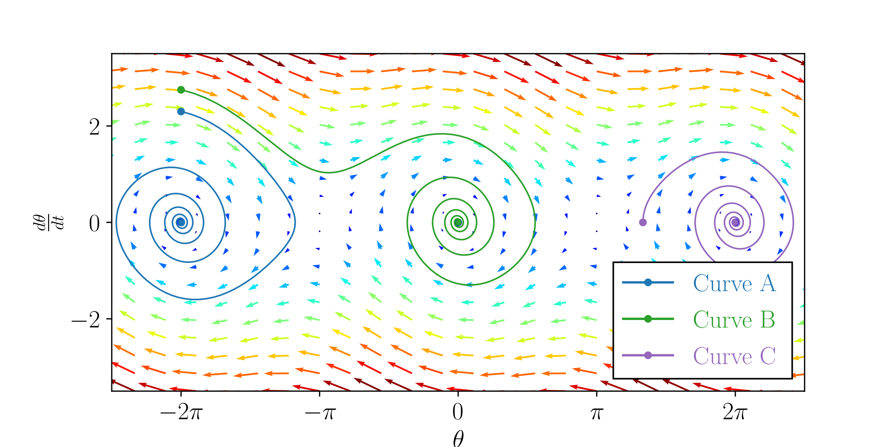

+++
title = "Modelos de péndulo"
date = 2022-05-20
weight = 2
description = "Modelos matemáticos y computacionales para péndulos simples"

[extra]
local_image = "img/pendulum_modeling.webp"
github = "https://github.com/pedropontesgarcia/pendulum-modelling"

[taxonomies]
tags = ["Matemáticas", "Académico", "Ensayo"]
+++

> *¿Cómo puede modelarse matemáticamente el comportamiento de un péndulo?*

Este fue el título de mi monografía del Bachillerato Internacional, un trabajo de 42 páginas en el que exploré distintos modelos matemáticos y computacionales para describir el comportamiento de un péndulo.

Mi supervisora, Paulina Szymczak-Ønnerstad, merece una mención especial por su paciencia, sus consejos y sus comentarios detallados sobre los borradores.

## Distinciones

- [Premio Nacional Noruego a Jóvenes Investigadores en 2022, segundo puesto](https://ungeforskere.no/tidligere-vinnere/)

## Texto completo

- [Disponible en la web del Consejo de Investigación de Noruega](https://ungeforskere.no/wp-content/uploads/2024/04/2_plass_NT_2022_PedroPontesGarcia.pdf)
