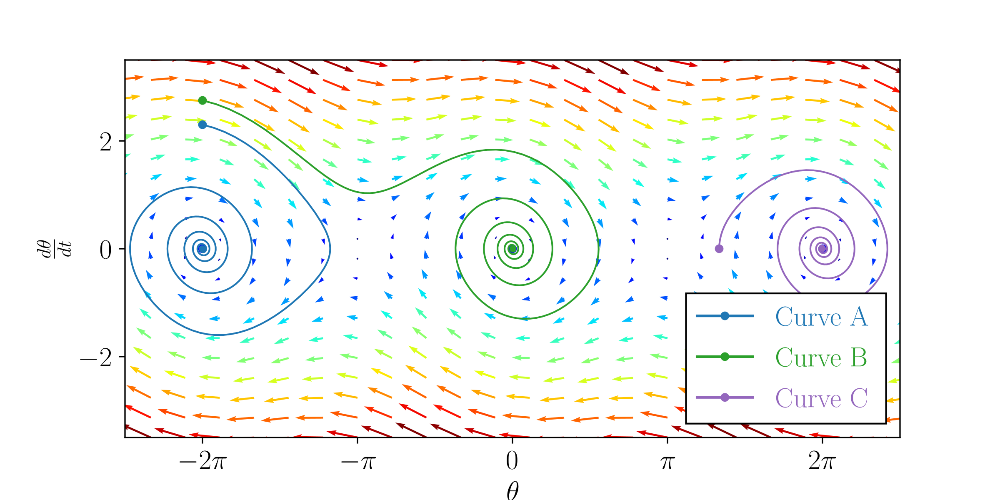

+++
title = "Pendulum modeling paper"
date = 2022-05-20
weight = 2
description = "Mathematical and computational models for simple pendulums"

[extra]
local_image = "img/pendulum_modeling.webp"
github = "https://github.com/pedropontesgarcia/pendulum-modelling"

[taxonomies]
tags = ["Mathematics", "Academic", "Paper"]
+++

> *How can the behaviour of a pendulum be modelled mathematically?*

This was the title of my IB extended essay, a 42-page paper exploring different mathematical and computational models to describe the behaviour of a pendulum.

My supervisor Paulina Szymczak-Ønnerstad deserves a special mention here due to her patience, her advice and her thorough feedback on the drafts.

## Distinctions

- [Second place in the Norwegian Young Researchers' Award in 2022](https://ungeforskere.no/tidligere-vinnere/)

## Full text

- [Available  at the Research Council of Norway website](https://ungeforskere.no/wp-content/uploads/2024/04/2_plass_NT_2022_PedroPontesGarcia.pdf)
