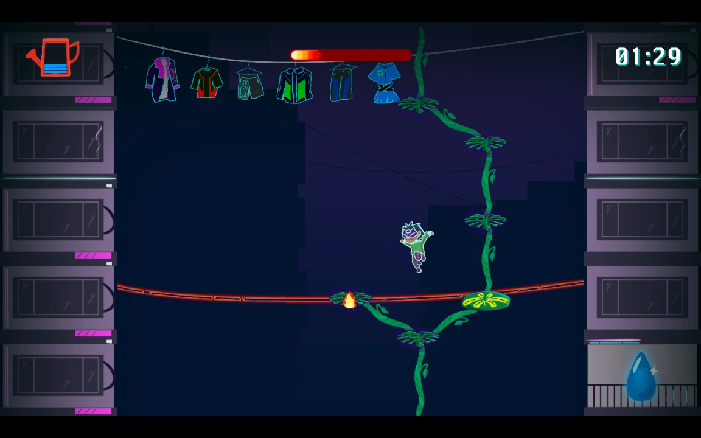
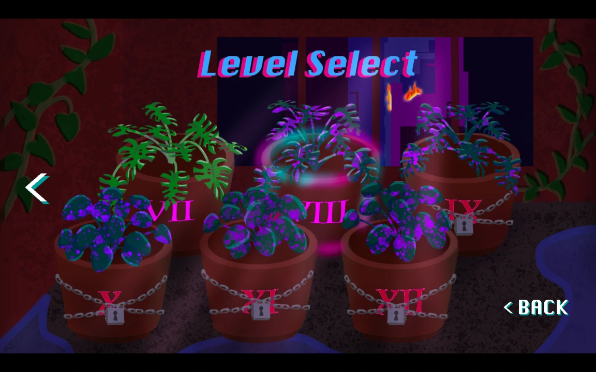
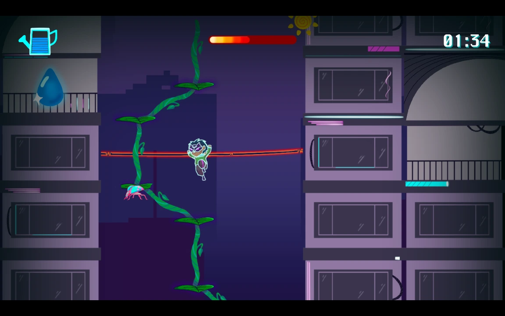
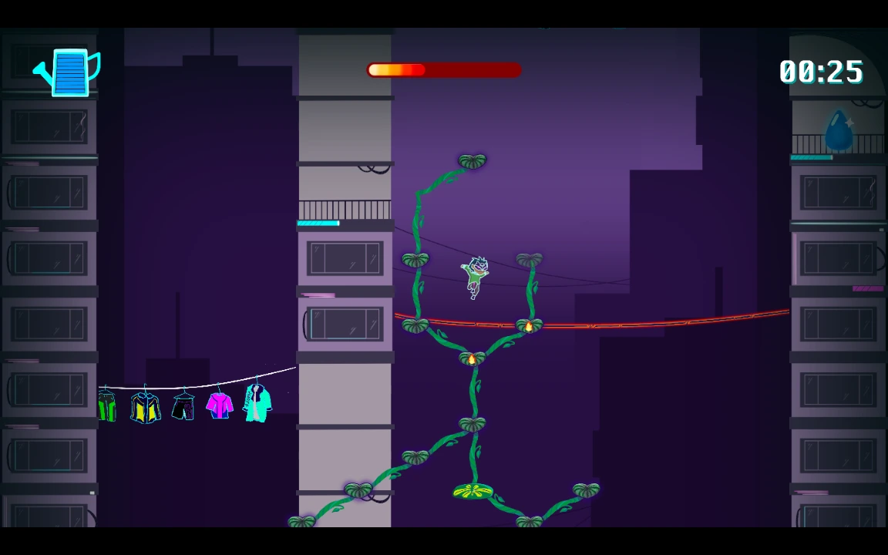

+++
title = "Phytopolis"
date = 2024-05-16
weight = 1
description = "Juego de plataformas y gestión estratégica de recursos en Java/LibGDX"

[extra]
local_image = "img/phytopolis_logo.webp"
github = "https://github.com/pedropontesgarcia/phytopolis"

[taxonomies]
tags = ["Diseño de videojuegos", "Académico"]
+++

> Cultiva y protege una planta floreciente frente a los peligros de una sociedad descuidada, hasta que alcance un cielo despejado más allá de los tejados de una metrópolis contaminada, dejando atrás un legado verde y frondoso.

## Documentos técnicos

- [Especificación de arquitectura](arch.pdf)
- [Especificación de diseño](design.pdf)
- [Especificación de gameplay](gameplay.pdf)

## Descripción del concepto

Adéntrate en el mundo de Phytopolis, donde la naturaleza y la tecnología chocan en un enfrentamiento hipnótico. ¿Tu misión? Convertir un humilde brote en una vid exuberante mientras asciende por el caos de hormigón de una metrópolis ciberpunk. La luz solar que absorben las hojas mantendrá viva la planta, y el agua te permitirá hacerla crecer hacia arriba. Apaga incendios, aplasta insectos cibernéticos invasores y protege tu planta hasta que alcance los cielos despejados.

## Descarga

Descarga la [última versión](https://github.com/pedropontesgarcia/phytopolis/releases) según tu sistema operativo (ofrecemos versiones para Windows y macOS), descomprime los archivos y ejecuta el juego. Ten en cuenta que la versión para macOS no está firmada, por lo que es posible que debas [seguir estas instrucciones](https://support.apple.com/guide/mac-help/open-a-mac-app-from-an-unidentified-developer-mh40616/mac) para poder abrirla.

## Primeros pasos

- **Movimiento:** Usa `A` y `D` para moverte horizontalmente, `W` para saltar y `S` para dejarte caer a través de hojas.
- **Crecimiento:** Haz clic sobre las previsualizaciones de ramas para construirlas; mantén pulsado shift izquierdo y haz clic sobre las hojas para construirlas o mejorarlas.
- **Gestión de recursos:** Construir y mejorar ramas y hojas requiere agua, que se recoge al chocar con gotas de agua.
- **Luz solar:** Recoge luz solar que cae del cielo posicionando bien las hojas para añadir tiempo al temporizador.
- **Desafíos:** Apaga fuegos haciendo clic sobre ellos (gastando agua) y aplasta insectos saltando sobre ellos.
- **Navegación:** Desplázate por los niveles con la rueda del ratón; vuelve a centrar la cámara en el jugador pulsando cualquier tecla de movimiento.
- **Personalización:** Ajusta controles, gráficos y sonido desde los menús.

## Imágenes

#### &copy; 2024 Syndic8  
*Jordan Rudolph, Pedro Pontes García, Alanna Cooney, Ireanne Cao, Kevin Chang, Amy Mai, Shirley Li, Tawakalt Bisola Okunola*
