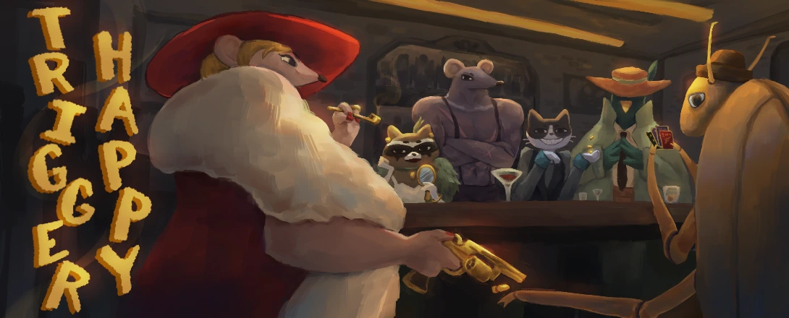
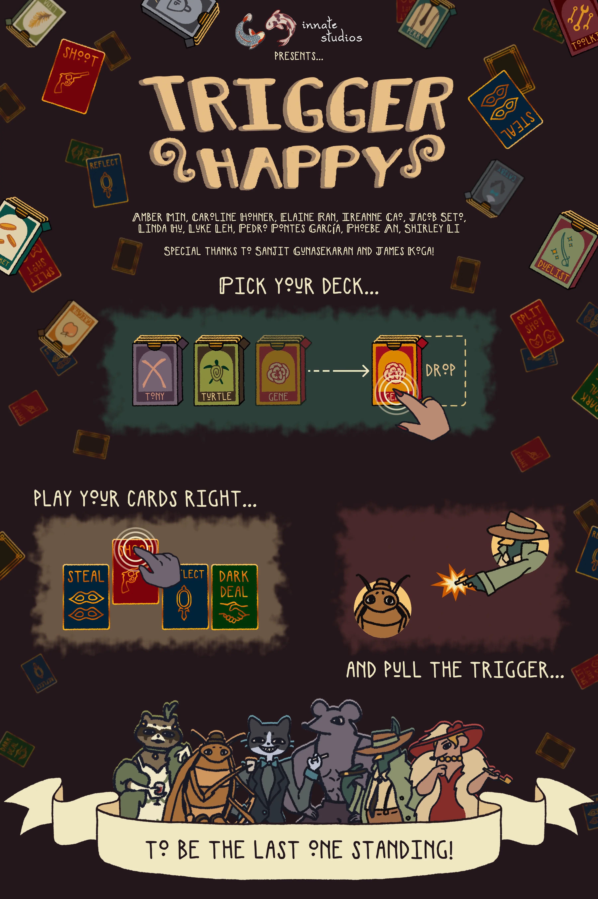
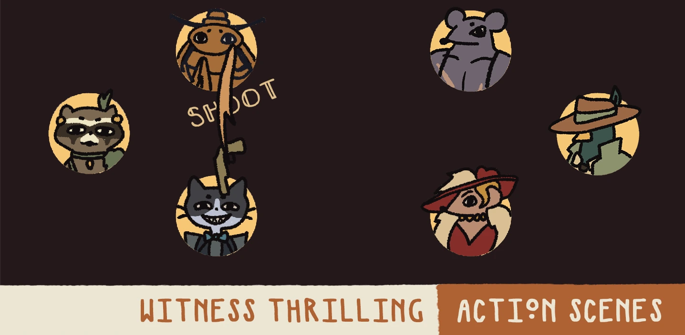
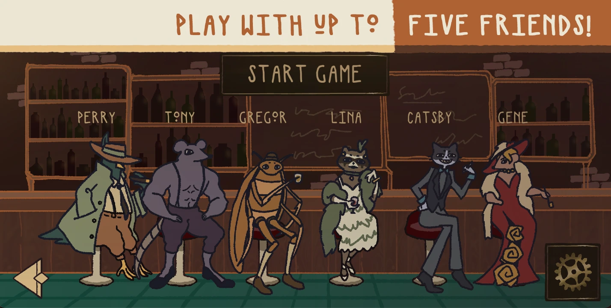
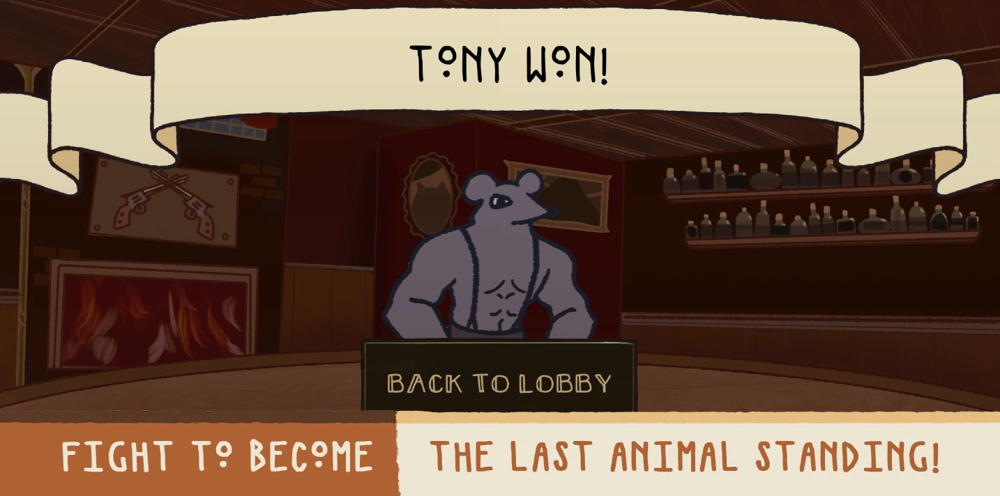

+++
title = "Trigger Happy"
date = 2025-05-17
weight = 1
description = "Juego multijugador de cartas tipo battle royale para móviles, en C++/CUGL"

[extra]
github = "https://github.com/pedropontesgarcia/trigger-happy"
local_image = "img/th_logo.webp"

[taxonomies]
tags = ["Diseño de videojuegos", "Académico"]
+++

> En un Chicago alternativo de los años 20, las calles están dominadas por animales armados. El caos estalla en un tiroteo mortal entre bandas rivales sin escrúpulos. Con el peligro cada vez más cerca, deberás tomar decisiones en fracciones de segundo: roba, dispara y supera a tus enemigos. ¿Quién será el último animal en pie?

## Documentación técnica

- [Especificación de arquitectura](arch.pdf)
- [Especificación de diseño](design.pdf)
- [Especificación de mecánicas](gameplay.pdf)

## Descripción del concepto

*Trigger Happy* es un juego multijugador por turnos tipo *battle royale* para móviles, en el que los jugadores derrotan a sus oponentes eligiendo acciones como disparar, robar o reflejar balas. Está pensado para grupos de 3 a 6 jugadores.

## Descarga

*Trigger Happy* está diseñado principalmente para iPhone 13 en adelante, pero también ofrecemos un APK para Android y una versión reducida del juego llamada TH Lite. Puedes acceder a la versión completa a través de este [enlace de TestFlight](https://testflight.apple.com/join/ezHZ4ZTa), y a la versión TH Lite desde este otro [enlace de TestFlight](https://testflight.apple.com/join/d2eTfCKF), que funciona mejor en modelos antiguos de iPhone y iPad. Si la versión completa se bloquea al cargar, te recomendamos probar TH Lite.

## Guía

*Trigger Happy* es un juego multijugador en red, así que deberías pedirle a alguien que juegue contigo. Para crear una sala, selecciona “Host game” en el menú principal. Para unirte a una sala, selecciona “Join game” y pídele al anfitrión que comparta el código de sala. Introdúcelo en el teclado y selecciona “Connect”. Podrás elegir tu personaje al unirte y cambiarlo más adelante pulsando sobre él.

Una vez estén todos los jugadores en la sala, el anfitrión debe pulsar “Start game”, lo que os llevará a la escena de selección de mazos. Puedes inspeccionar los distintos mazos pulsando sobre ellos, y ver la descripción de cada carta pulsando sobre ellas individualmente. Cuando tengas tu decisión, arrastra el mazo deseado a la zona de selección de la derecha. Una vez todos estén listos, comenzará la partida.

Cada ronda incluye un tiempo limitado para elegir acciones, que se seleccionan arrastrando cartas desde la mano hasta la zona de juego, o pulsando el botón de “Redraw” a la derecha. Las cartas sin objetivo tienen una zona genérica; las que requieren objetivo tienen una zona específica para cada jugador. El temporizador de ronda se basa en una fórmula de decaimiento exponencial según el número de jugadores vivos. Desliza hacia los lados para ver al resto de jugadores si sois más de cuatro.

Las acciones disponibles son:

- **Pacto oscuro:** Recarga munición a cambio de descartar una carta.
- **Disparo:** Usa 1 munición para disparar a otro jugador.
- **Disparo doble:** Usa 2 municiones para disparar a un jugador elegido y a otro al azar.
- **Robo:** Quita 1 munición a otro jugador.
- **Reflejo:** Refleja el disparo de un jugador.
- **Descarte:** Recarga 1 munición y roba una nueva mano.

## Póster promocional

## Imágenes

---

#### &copy; 2025 Innate Studios

*Amber Min, Caroline Hohner, Elaine Ran, Ireanne Cao, Jacob Seto, Linda Hu, Luke Leh, Pedro Pontes García, Phoebe An, Shirley Li*
