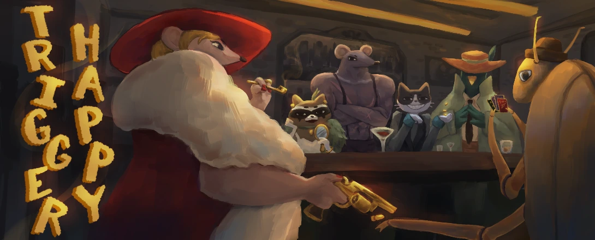
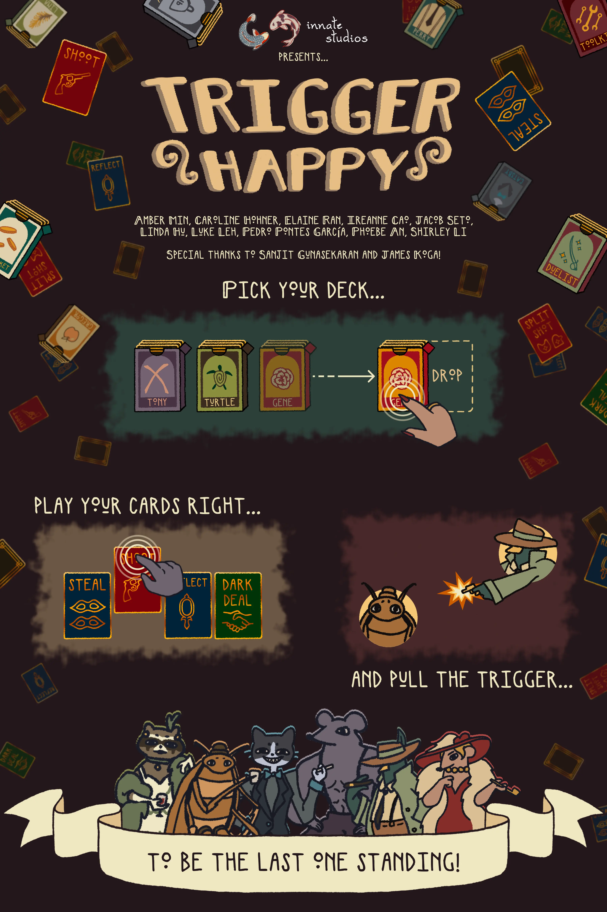
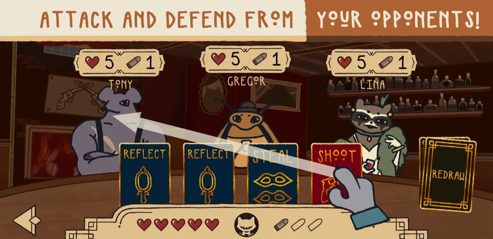
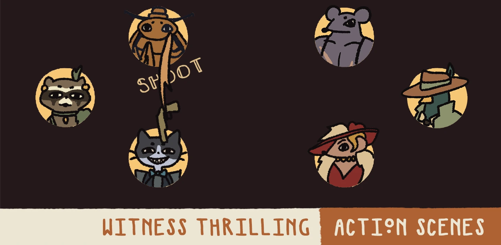
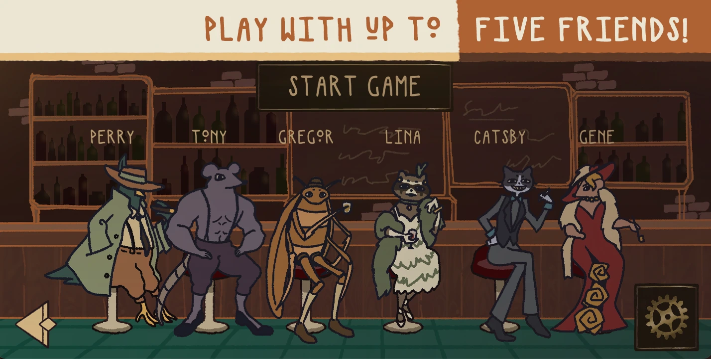
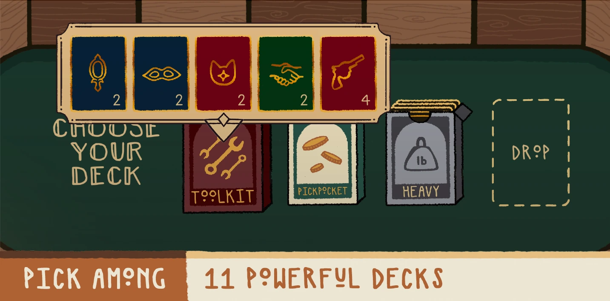
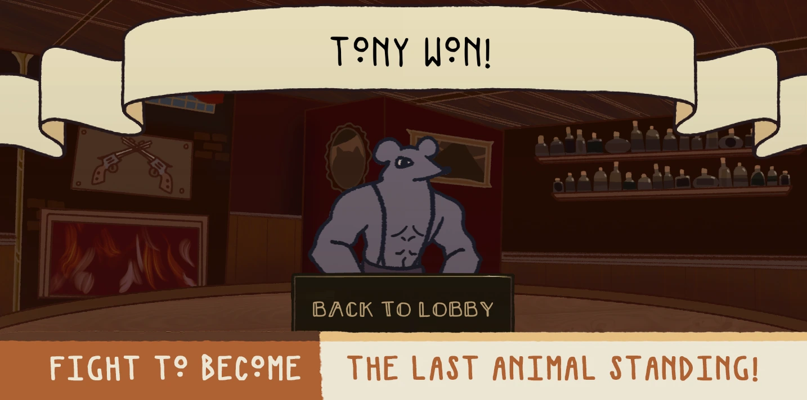

+++
title = "Trigger Happy"
date = 2025-05-17
weight = 1
description = "Multiplayer last-man-standing mobile card game in C++/CUGL"

[extra]
github = "https://github.com/pedropontesgarcia/trigger-happy"
local_image = "img/th_logo.webp"

[taxonomies]
tags = ["Game design", "Academic"]
+++

> In an alternate 1920s Chicago, the streets are ruled by gun-slinging animals. Chaos erupts in a high-stakes deadly shootout between ruthless rival mobsters. With danger closing in, you must make split-second decisions—steal, shoot, and outsmart your foes. Who will be the last animal standing?

## Technical documents

- [Architecture specification](arch.pdf)
- [Design specification](design.pdf)
- [Gameplay specification](gameplay.pdf)

## Concept statement

Trigger Happy is a turn-based, last-man-standing mobile game where players defeat their opponents by choosing actions such as shooting, stealing, or reflecting bullets. It is targeted towards groups of 3-6 players.

## Download

Trigger Happy is primarily targeted towards iPhone 13s and higher, but we provide an Android APK and an iOS link for TH Lite, a lightweight version of Trigger Happy. We provide the [TestFlight invite link](https://testflight.apple.com/join/ezHZ4ZTa) to our full version of the game, and another [invite link](https://testflight.apple.com/join/d2eTfCKF) for TH Lite, which runs more smoothly on older iPhones and iPads. If you experience crashes during loading with the full version, we recommend that you try TH Lite.

## Guide

Trigger Happy is a networked multiplayer game, so you should ask someone to try out the game with you. To create a lobby, select "Host game" on the main menu. To join another player's lobby, select "Join game" and ask the host to share the lobby code with you. Enter it on the keypad and select "Connect". You will be able to select your character when joining the lobby, and you may change it once selected by pressing on it.

Once all players are in the lobby, the host must press "Start game", which will take all the players to the deck selection scene. You may inspect the different decks by pressing on them, and access individual card descriptions by pressing on each card. Whenever you have made your choice, drag your desired deck to the drop zone on the right. Once all players are ready, the game will begin.

Each round allocates some time to action selection, which is done by dragging cards from the hand towards a drop zone, or tapping the redraw button on the right. Untargeted cards have a generic drop zone, while targeted cards have drop zones corresponding to each player. The round timer is based on an exponential decay formula corresponding to the number of players alive. Swipe left and right on the screen in order to see other players in sessions with >4 players.

The following actions are available:

- **Dark Deal:** Refill ammo, at the expense of discarding a card.
- **Shoot:** Use 1 ammo to shoot another player.
- **Split Shot:** Use 2 ammo to target a player of your choice and another one at random.
- **Steal:** Take 1 ammo from another player.
- **Reflect:** Reflect up to one player's shot.
- **Redraw:** Refill 1 ammo and redraw your hand.

## Promotional poster

## Screenshots

---

#### &copy; 2025 Innate Studios

*Amber Min, Caroline Hohner, Elaine Ran, Ireanne Cao, Jacob Seto, Linda Hu, Luke Leh, Pedro Pontes García, Phoebe An, Shirley Li*
