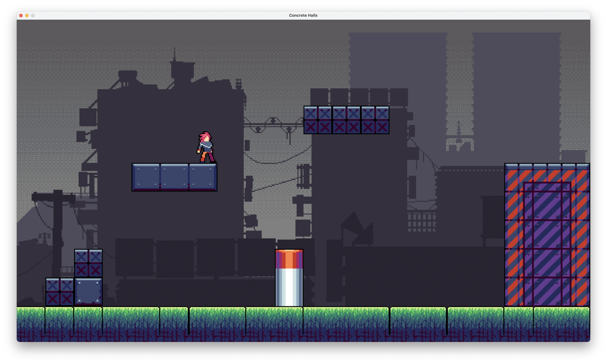

+++
title = "Zephyr"
date = 2023-12-09
weight = 3
description = "Motor de videojuegos ligero en OCaml con soporte para física 2D"

[extra]
local_image = "img/neocaml_logo.webp"
github = "https://github.com/pedropontesgarcia/zephyr"

[taxonomies]
tags = ["Diseño de videojuegos", "Académico"]
+++

## El motor Zephyr

Presentamos con orgullo el motor de videojuegos Zephyr, un framework de desarrollo sencillo y accesible para OCaml. Aprovechando la popular biblioteca gráfica SDL2 y la elegancia del lenguaje OCaml, Zephyr facilita la creación de niveles personalizados con distintos obstáculos, incorporando funciones como sprites animados, físicas avanzadas de colisiones, mapas de teselas (*tilemaps*) y carga optimizada de texturas.

## Concrete Halls: un juego creado con Zephyr

Como demostración del potencial de Zephyr, presentamos *Concrete Halls*, un juego ciberpunk de desplazamiento lateral en 2D basado en una historia emocionante. *Concrete Halls* aprovecha la sencillez en la creación de niveles que ofrece el motor Zephyr e incluye un total de 15 niveles de plataformas personalizados, así como una escena introductoria tras el menú principal. El juego demuestra que los tipos y funciones personalizados de Zephyr son muy fáciles de usar para desarrollar un videojuego 2D a medida.

#### &copy; 2023 NEOCAML Interactive

*Luis Hernández Rocha, Tawakalt Bisola Okunola, Pedro Pontes García*
